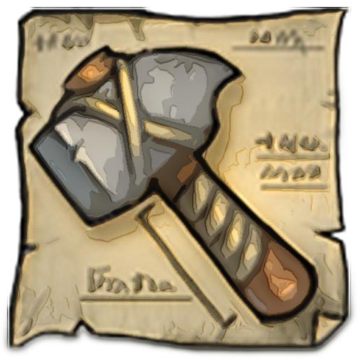

<h1 align="center">
  
  Celeste Unit Builder
</h1>

<p align="center">
    Build, compare and share your Age of Empires Online units
</p>

## Project setup
```
npm install
```

### Generate database, meta, images and optimization

```
npm run generate
```

### Compiles and hot-reloads for development
```
npm run serve
```

### Compiles and minifies for pre-production

(Robots.txt denies everything)

```
npm run build
```

### Compiles and minifies for production

(Robots.txt allows everything)

```
npm run build-prod
```

### Lints and fixes files
```
npm run lint
```

### Customize configuration
See [Configuration Reference](https://cli.vuejs.org/config/).

### Server for build sharing

The server for build sharing is located in the `server` directory. For deployment, the content of the `dist` folder generated by building the front app must be located into a `front` directory in the server's working directory.

Builds are stored using sqlite, in a file named "build-db.sqlite" located in the server's working directory, and expire after 6 months. It is recommended to clear this file with each new deployment to avoid old builds causing errors in case something has changed in the game files.

The server should be running behind an apache or nginx proxy configured with gzip and caching.

**Caching exceptions:**
- `front/service-worker.js` and `front/sitemap.xml` should NOT be cached

## License

Age of Empires Online © Microsoft Corporation. This unit builder application was created under Microsoft's [Game Content Usage Rules](https://www.xbox.com/en-us/developers/rules) using assets from Age of Empires Online, and it is not endorsed by or affiliated with Microsoft.

This application is MIT Licensed. Copyright © 2020 Jérémy LAMBERT (SystemGlitch)
